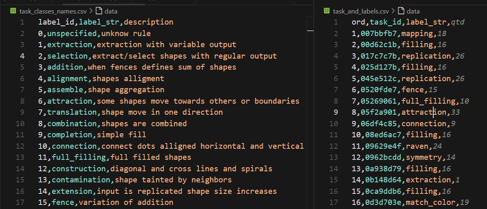
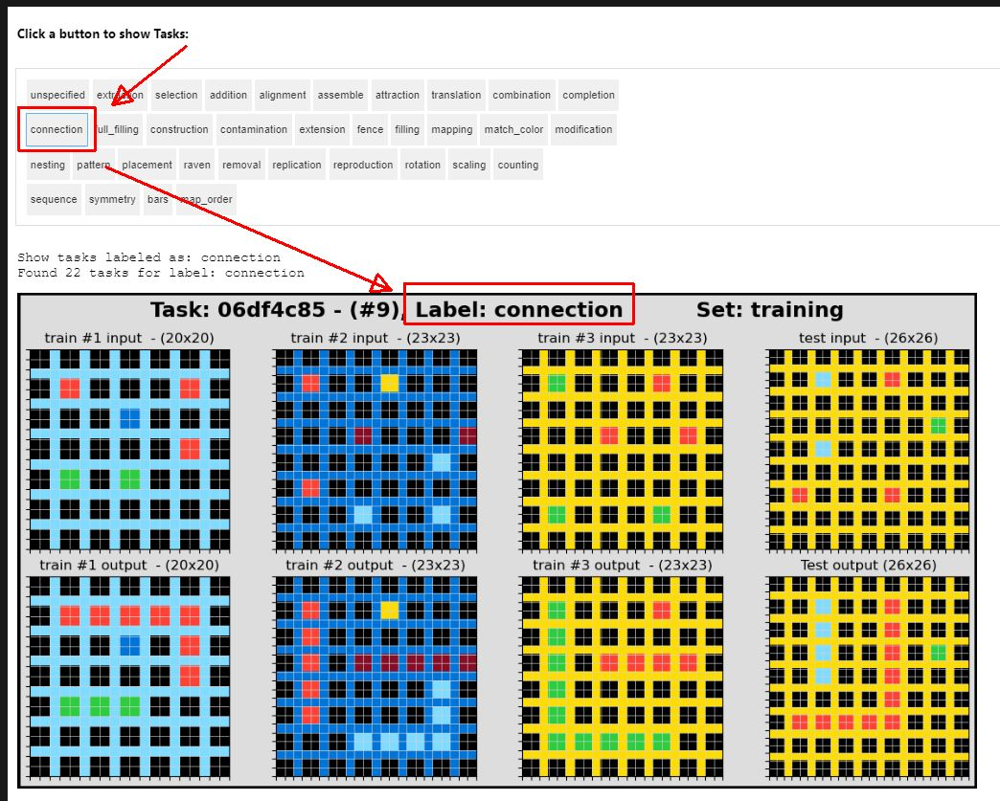

"You can't manage what you don't know."

# Human-Labeled Data for ARC Prize 2024

"You can't manage what you don't know."

Human-labeled data is essential for machine learning success, serving as the ground truth that enables models to learn meaningful patterns and make more accurate predictions. 

For the ARC Prize challenge specifically, we carefully labeled training data to help models better understand and evaluate the learning steps, allowing them to have more parameters to distinguish between one example to another. When humans take the time to provide thoughtful labels, they create a reliable compass that guides model training toward human-aligned understanding and performance.

That said, we recognize that a small team of curators may not be able to produce the optimal labeled dataset due to several factors, such as limited cross-validation, fatigue, and time constraints. Furthermore, there is **no guarantee** that the labeled data will lead to better results, as the effectiveness of the dataset ultimately depends on a well-implemented classifier and a robust solver model.

I would also like to express my sincere gratitude to my daughter Alice for her patience and dedication in carrying out this work with me.

 # About this Project

 This notebook project contains:
 * a CSV file with labels used - task_classes_names.cvs
 * a CSV file with all ARC Prize 2024 training tasks labeled
 * a Jupyter Notebook with interactive viewer to display the set of training tasks
 * source code agregate the labels into your data.
 
 This is release under MIT License 
   
The CSV data (screenshot):

The Viewer and the challenge category selection:

